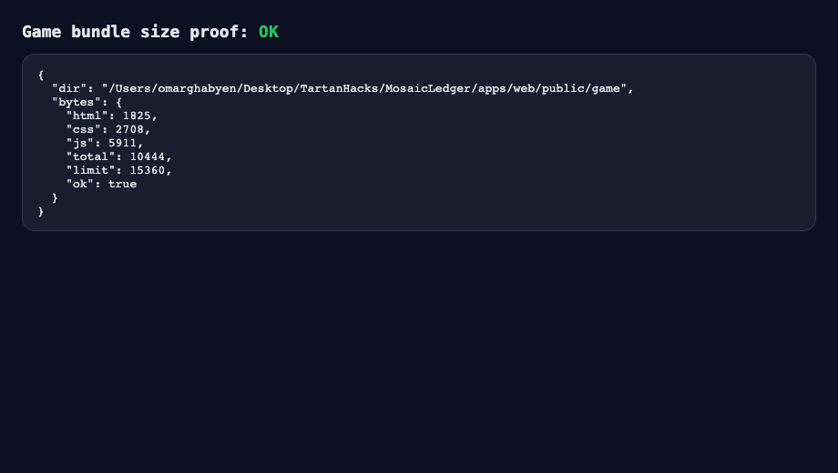
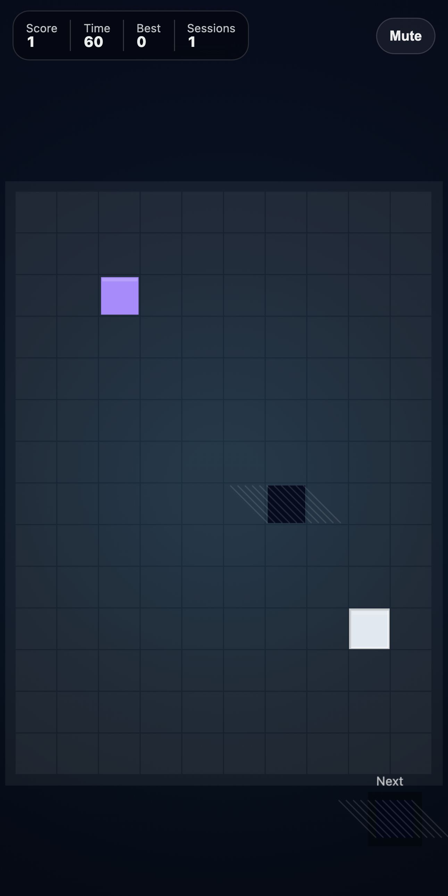

# AppLovin Submission Checklist (GAME-013)

Goal: a **playable, self-contained mobile browser game under 15KB** (HTML+JS+CSS) with proof.

## What To Demo

- Open `/game` on mobile.
- Tap **Start**.
- Tap tiles 3+ times: score increases.
- Toggle **Mute** (persists).
- Let the timer finish: best score updates.

## How To Run Locally

1. `pnpm install`
2. `pnpm dev`
3. Open `http://localhost:3000/game`

Note: `/game` is served as static files (no Next.js runtime bundle).

## Size Proof (< 15KB)

Run:

```bash
pnpm game:build
pnpm game:size
```

Expected output includes the exact byte counts and `ok: true`.

Evidence asset (committed):

- `docs/assets/applovin-size-proof.png`



## Gameplay Media

Evidence screenshot (committed):

- `docs/assets/applovin-gameplay.jpg`



15-second screen recording (manual, for submission):

1. Open `/game` in Chrome or Safari on a phone.
2. Record the screen for ~15 seconds (Start -> tap tiles -> score change -> mute toggle).
3. Save as `applovin-gameplay-15s.mp4` (attach to Devpost / submission form).

## Regenerating Evidence Assets (Optional)

This repo has Playwright “evidence” hooks (env-gated) that can write fresh screenshots into `docs/assets`:

```bash
CAPTURE_EVIDENCE=1 pnpm -w test:e2e
```

This will refresh:

- `docs/assets/applovin-size-proof.png`
- `docs/assets/applovin-gameplay.jpg`
- (and also) `docs/assets/ripple-xrpl-roundups.png`
