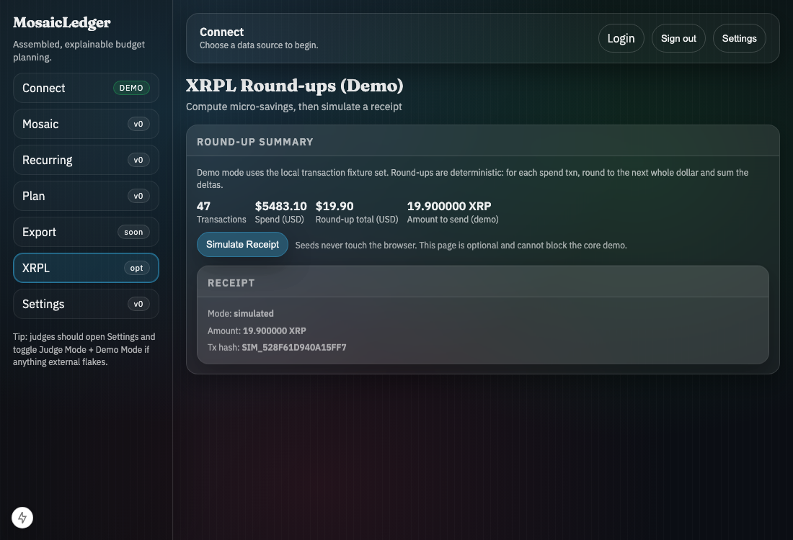

# Ripple Track MVP Use Case (XRPLP-008)

## One-page story: students, micro-savings, and locked goal pots

### The problem
Students usually do not have “room” in their budget for saving. Traditional advice is vague (“save more”), and saving is easy to undo when money is tight.

### The MosaicLedger approach
MosaicLedger starts from real transactions (or Judge/Demo data), assembles spending into a Mosaic, and generates deterministic next actions. Then it adds an **opt-in micro-savings rail**:

1. Compute round-ups deterministically from spend transactions.
2. Deposit round-ups into a “goal pot” on XRPL testnet.
3. Optionally **lock** that pot using XRPL escrow until a goal date (e.g., tuition payment date).

### Why escrow matters (locking until goal date)
Escrow turns “I saved it” into “I can’t accidentally spend it”. It is a behavioral guardrail:

- **Commitment**: funds are locked until `finishAfter` (goal date).
- **Transparency**: escrow details are verifiable on-ledger.
- **Demo safety**: when testnet is unstable, MosaicLedger can simulate receipts deterministically.

## Evidence (demo-safe)

### Receipt hash (simulated, deterministic)
MosaicLedger generates a deterministic simulated receipt hash for the same inputs:

- Mode: `simulated`
- Memo: `mosaicledger_roundup_demo`

### Screenshots
Submission evidence (generated from `/app/xrpl` using the Playwright evidence test with `CAPTURE_EVIDENCE=1`):

- `docs/assets/ripple-xrpl-roundups.png` (XRPL Round-ups page + receipt)
- `docs/assets/ripple-health.png` (optional: `/health` showing XRPL env presence as present/missing)

## How to demo (optional, 20s)

1. Go to Settings and toggle `XRPL` ON.
2. Open `/app/xrpl`.
3. Click **Simulate Receipt**.
4. Point to the tx hash and note: seed never touches the browser; simulation is deterministic for judge reliability.
